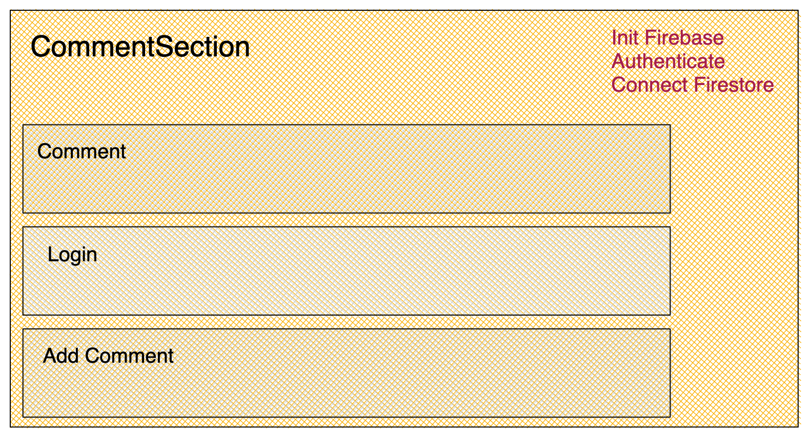

import { Card, Text } from "theme-ui";

This article covers Firebase integration in a React/Reactjs application. It uses
Firestore to build comments system for a Gatsby blog and will cover
the following

1. React Firestore(Firebase) integration
2. React Firebase Authentication integration
3. Gatsby blog comments as an end product.

<Card
  sx={{
    maxWidth: 512,
  }}
></Card>

## Getting started

This tutorial is an updated version of a previous tutorial.
In this part, we will build a complete solution to add comments
to a Gatsby blog.

There are solutions like Disqus, which I have written about in the past,
but I did not realize at the time that it comes with its issues of
targetted ads, user tracking et al.

Source change at https://github.com/ch4nd4n/chandankumar.com/commit/fc4b00f4ab5c2daf88d45a6d7d2bd67324e8ee32
will be handy to get an idea of final source code.

To summarize, I am wrapping comments functionality in a React component
`CommentSection` which has 3 sub-components. Oh, and before I forget
I highly recommend using Firebase Emulator instead of using
production Firebase.

1. Comments: List of comments
2. Login/Authentication (and logout)
3. Add comment



A grunt of the logic is in `CommentSection`, and the rest of the
components are more or less dumb components.

So we begin with getting a reference to Firestore and initialize firebase with the necessary configuration.

```tsx
db = getFirestore(app);
app = initializeApp(firebaseConfig);
```

### Listing comments

The next step is to write a function that fetches comments, so
if comments are in a collection called `blogPosts` (I know, not
the best collection name to store comments), We query it like

```tsx
const commentsCol = query(
  collection(db, "blogPosts"),
  where("slug", "==", slug)
);
```

Iterate over this Firestore collection and convert it list of comments like below.

> Remember to update Firestore rule to allow read and write

### Configure Firestore rule

Firestore rules are required to prevent unauthorized access or abuse

```
match /blogPosts/{multiSegment=**} {
    allow read;
    allow write: if request.auth != null;
}
```

Why firestore rules?

> With Cloud Firestore Security Rules, you can focus on building
> a great user experience without having to manage infrastructure
> or write server-side authentication and authorization code.
> https://firebase.google.com/docs/firestore/security/get-started

```tsx
const commentSnapshot = await getDocs(commentsCol);
const commentList = commentSnapshot.docs.map((doc) => {
  return { ...doc.data(), id: doc.id };
});
```

We add a component to render comments which is

```tsx
const Comment = (prop) => {
  const { getComments, comments } = prop;

  useEffect(() => {
    getComments();
  }, []);

  return (
    <div>
      <h3>Comments</h3>
      <ul>
        {comments.map((comment) => (
          <li key={comment.id}>{comment.comment}</li>
        ))}
      </ul>
    </div>
  );
};
```

and the parent component will pass the comments reference

```tsx
<Comment getComments={getComments} comments={comments} />
```

### Firebase Authentication

For authentication, I am using a rudimentary form that lets a user enter
username and password

We get firebase auth reference in the parent component and pass it to
the child component

```tsx:title=comment-section.tsx
const auth = getAuth();
```

When the user clicks the "login" button we use `signInWithEmailAndPassword` from firebase
to authenticate the user. There are a lot of things to be cleaned up like

- to handle errors and exceptions
- cleaning up the UI.

```tsx:title=login.tsx
const doFirebaseLogin = (event: React.FormEvent) => {
  event.preventDefault();
  signInWithEmailAndPassword(auth, email, password);
};
```

### Add Comment

In the parent component add a function that writes to Firestore and
pass on the function to `AddComment` component.

```tsx:title=comment-section.tsx
async function addComment(comment) {
  const newComment = doc(collection(db, "/blogPosts"));
  setDoc(newComment, { slug, comment }, { merge: false });
}
```

and pass on the reference to AddComment

```tsx:title=comment-section.tsx
<AddComment user={user} addComment={addComment} />
```
