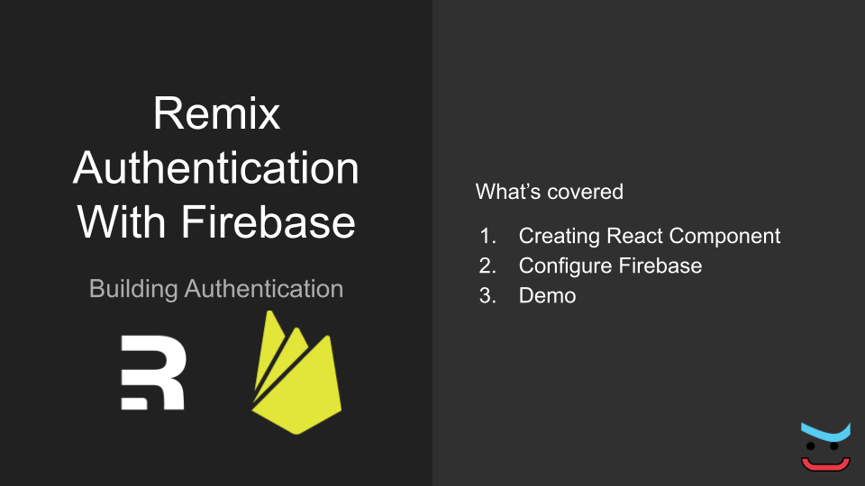

import { Card, Text } from "theme-ui";


A short video tutorial on integrating Firebase authentication
in Remix. The integration process is quite similar to any other
React application.

> I am learning Remix, and these are my notes
> in this process. Implementing things in Remix has been a breeze
> so far.

<Card
  sx={{
    maxWidth: 480,
    mx: "auto",
  }}
>
  <iframe
    width="100%"
    height="300px"
    src="https://www.youtube.com/embed/7rLTDrMfHnk"
    frameborder="0"
    allow="accelerometer; picture-in-picture"
    allowfullscreen
  ></iframe>
</Card>

You can read up or watch the hands-on video.

Back to the subject, we got to do the following

1. Get FirebaseConfig from Firebase Console
2. Install Firebase dependency
3. Create React Component.
4. Integrate Firebase library.

To add Firebase Auth into Remix app, we start off with a
React Component, called `FirebaseLogin`. We wrap Firebase
related calls into this component.

Note that this is not a pure component, and you may want to
refactor it further.

Instead of using `SignInWithEmailAndPassword` we configure Google Authentication.

The heart of the implementation is

```tsx
initializeApp(firebaseConfig);
const provider = new GoogleAuthProvider();
const auth = getAuth();

function googleLogin() {
  signInWithPopup(auth, provider);
}
```

The above lines of code initialize Firebase and GoogleAuthProvider.
`signInWithPopup` method takes care of opening up the Google Sign-in window.

The final component would look something like below.

```tsx:title=firebase-login.tsx
import { initializeApp } from "firebase/app";
import {
  getAuth,
  GoogleAuthProvider,
  onAuthStateChanged,
  signInWithPopup,
  User,
} from "firebase/auth";
import { useState } from "react";
import firebaseConfig from "~/config/firebase";

initializeApp(firebaseConfig);
const provider = new GoogleAuthProvider();
const auth = getAuth();

function googleLogin() {
  signInWithPopup(auth, provider);
}

function logout() {
  auth.signOut();
}

export default function FirebaseLogin() {
  const [user, setUser] = useState<User | null>(null);
  onAuthStateChanged(auth, (result) => {
    result ? setUser(result) : setUser(null);
  });
  return (
    <>
      {!user && (
        <button className="btn" onClick={googleLogin}>
          Login
        </button>
      )}
      {user && (
        <>
          {user.displayName}
          <button className="btn" onClick={logout}>
            Logout
          </button>
        </>
      )}
    </>
  );
}
```

Include `FirebaseLogin` component in the file where you want
to link it up from. [Github Source](https://github.com/ch4nd4n/practice/blob/remix-tailwind-firebase-auth/remix/firebase-auth/app/components/firebase-login.tsx) of the file. Browse
all the files at https://github.com/ch4nd4n/practice/tree/remix-tailwind-firebase-auth/remix/firebase-auth

```tsx
import FirebaseLogin from "~/components/firebase-login";

export default function Index() {
  return (
    <div style={{ fontFamily: "system-ui, sans-serif", lineHeight: "1.4" }}>
      <h1>Firebase Authentication</h1>
      <FirebaseLogin />
    </div>
  );
}
```

## Summary

DevEx of Remix is awesome. There are some quirks that I have run into,
but, overall I love it. I am going to build a working application using
Remix and keep posting follow-ups.

You may like the following

1. [Remix Run Tutorial: Mongodb connection with Mongoose](/blog/remix-run-mongodb-tutorial)
